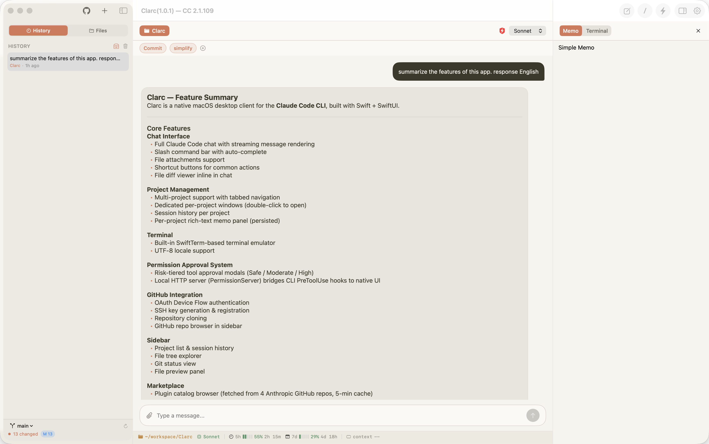

# Clarc

**The terminal was for the few. Clarc is for everyone.**

Escape the terminal-based CLI and leverage all Claude Code features through an intuitive GUI.

Native macOS desktop client for Claude Code.

---

## Screenshots

---

## Features

| Feature | Description |
|---------|-------------|
| **Streaming Chat** | Real-time streaming conversation with Claude Code. Markdown rendering, tool call visualization |
| **Multi-Project** | Register multiple projects and switch freely. Per-project session history, message queue, and background streaming |
| **Dedicated Windows** | Double-click a project tab to open it in its own independent window and work on multiple projects at once |
| **Per-Session Controls** | Model, permission mode, and effort level are chosen per session from the toolbar — defaults are configurable in Settings |
| **Permission Modes** | Ask · Accept Edits · Plan · Auto (AI-gated) · Bypass — switch on the fly from the chat toolbar |
| **Effort Levels** | Auto · Low · Medium · High · XHigh · Max — tune reasoning depth per session |
| **GitHub Integration** | OAuth authentication, SSH key management, repository browsing and cloning |
| **File Attachments** | Drag-and-drop image/file attachments. Smart ⌘V paste detects images, file paths, URLs, and long text |
| **Slash Commands** | Extensible command system with custom per-project commands; JSON import/export |
| **Shortcut Buttons** | Configurable quick-access buttons for frequently used messages or terminal commands |
| **Permission Management** | Risk-based approve/deny UI with Allow / Allow Session / Deny options and 5-minute auto-deny |
| **Skill Marketplace** | Browse and install official Anthropic plugins, refreshed every 5 minutes |
| **Model Selection** | All Claude Code aliases with localized descriptions (Opus, Sonnet, Haiku, 1M context, plan variants) |
| **Status Line** | Project path, model, 5h/7d rate limits, context window usage, and total response time at a glance |
| **Built-in Terminal** | SwiftTerm-based inspector terminal (resetable), plus full interactive terminal popup for /config, /permissions, /model |
| **File Explorer** | Project file tree with hidden-file toggle, Git status, syntax-highlighted preview and in-place editing |
| **Memo Panel** | Per-project rich-text memo pad with headings, lists, checkboxes, inline links, and markdown copy/paste |
| **Message Queue** | Queue messages while Claude is responding; cancel individual items with ESC or the × button |
| **Notifications** | Optional system notification with response preview when Clarc is in the background |
| **Themes** | Six accent-color themes: Terracotta · Ocean · Forest · Lavender · Midnight · Amber |
| **Localization** | Full English and Korean UI |
| **User Guide** | Built-in in-app help guide accessible from the toolbar |
| **Auto-update** | Sparkle-based automatic update checking |

---

## Requirements

- **macOS 15.0** or later
- **[Claude Code CLI](https://docs.anthropic.com/en/docs/claude-code)** must be installed
- **Xcode 16** or later (for building)

---

## Installation

1. Download the latest `Clarc-x.y.z.zip` from the [Releases](https://github.com/ttnear/Clarc/releases) page.
2. Unzip and move `Clarc.app` to your `Applications` folder.
3. Launch `Clarc.app`.

### First Launch on macOS 15 (Sequoia)

macOS Sequoia blocks the first launch of any downloaded app — even notarized ones — and routes approval through System Settings instead of the old right-click → Open flow.

When you see **"Apple could not verify 'Clarc.app' is free of malware..."**:

1. Click **Done** on the dialog.
2. Open **System Settings → Privacy & Security**.
3. Scroll to the Security section and click **Open Anyway** next to `Clarc.app`.
4. Confirm with your password or Touch ID.

After this one-time approval, Clarc launches normally. The app is signed with a Developer ID certificate and notarized by Apple — this prompt is standard macOS behavior, not a security warning specific to Clarc.

---

## License

Apache License 2.0 — see the [LICENSE](LICENSE) file for details.
